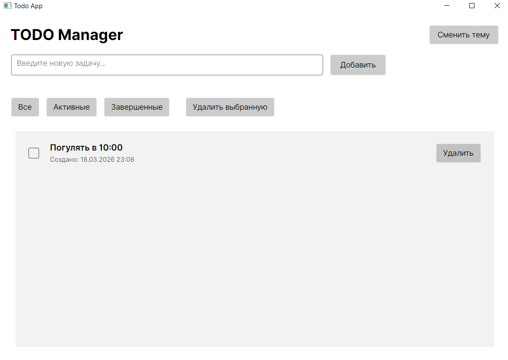
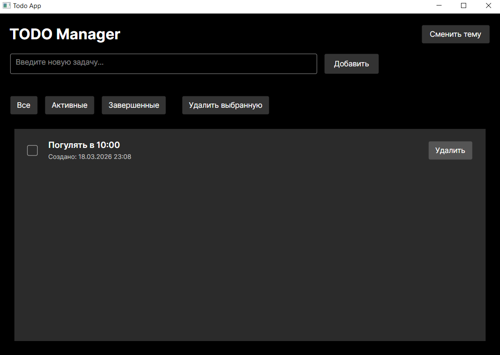
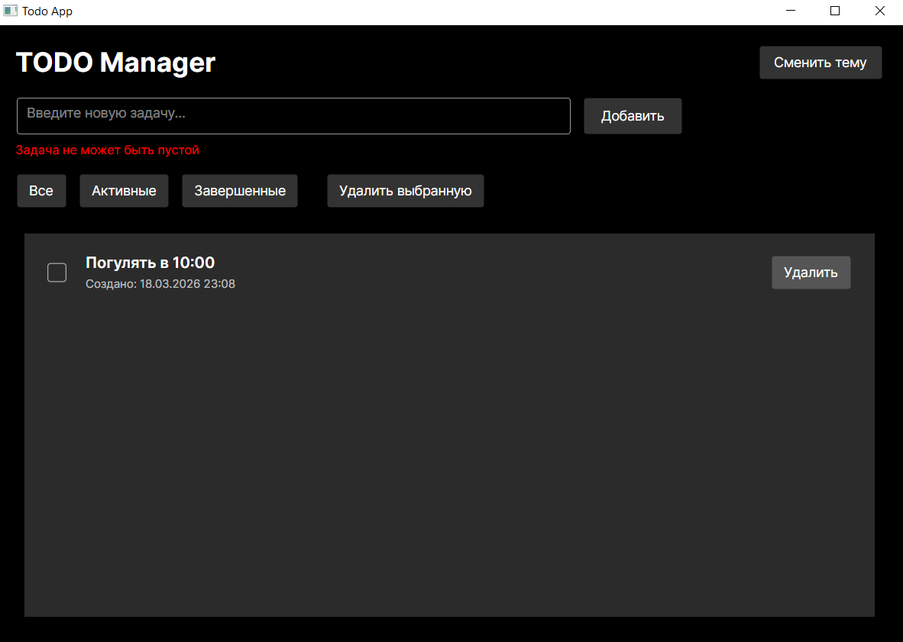

# TodoApp

Кроссплатформенное TODO-приложение, разработанное на **Avalonia UI** с использованием **.NET 8**, **C#**, архитектуры **MVVM** и библиотеки **ReactiveUI**.

## Функционал

- просмотр списка задач
- добавление новой задачи
- запрет на добавление пустой задачи
- изменение статуса выполнения задачи
- удаление задачи
- фильтрация задач:
  - Все
  - Активные
  - Завершенные
- сохранение данных в JSON
- автоматическая загрузка задач при следующем запуске
- поддержка светлой и тёмной темы

## Технологии

- .NET 8
- Avalonia UI 11
- C#
- MVVM
- ReactiveUI
- JSON
## Инструкция по запуску

1. Установить **.NET 8 SDK**
2. Клонировать репозиторий
3. Перейти в папку проекта
4. Выполнить команду:

```bash
dotnet restore
dotnet run

### 1. Главное окно программы


### 2. Программа в тёмной теме


### 3. Ошибка валидации при пустом вводе
